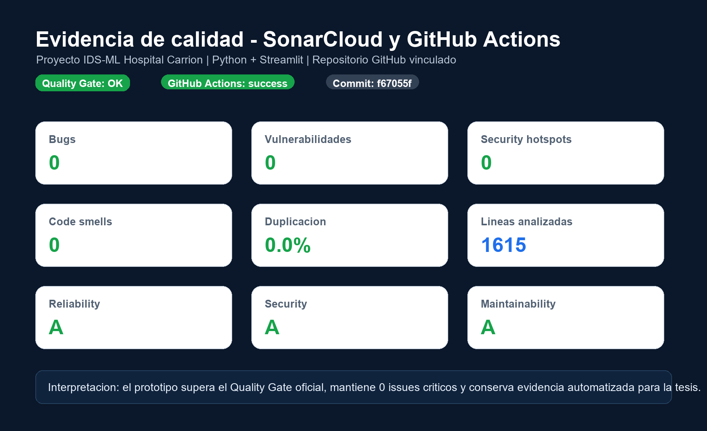
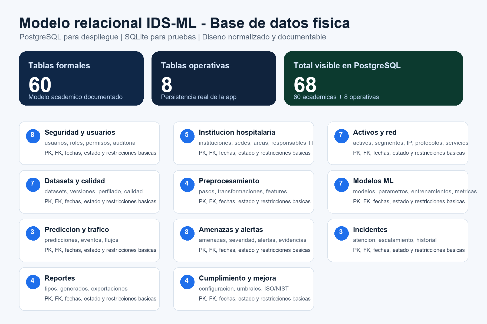
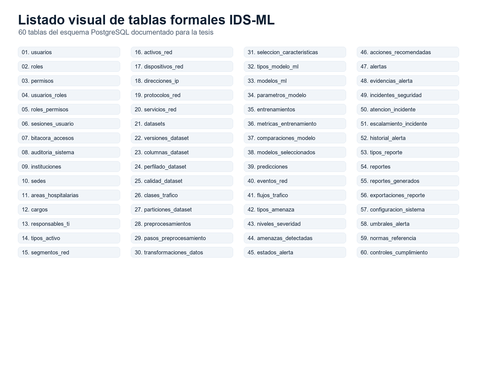
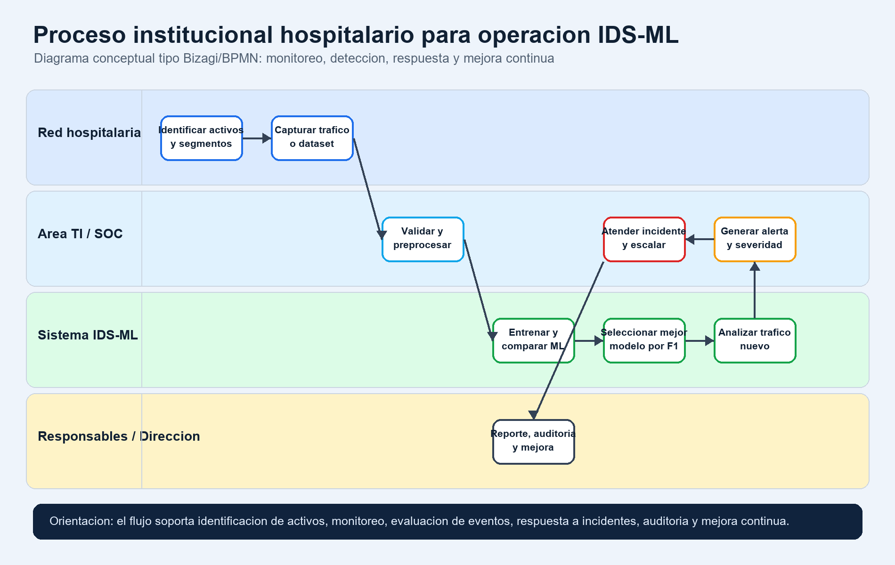
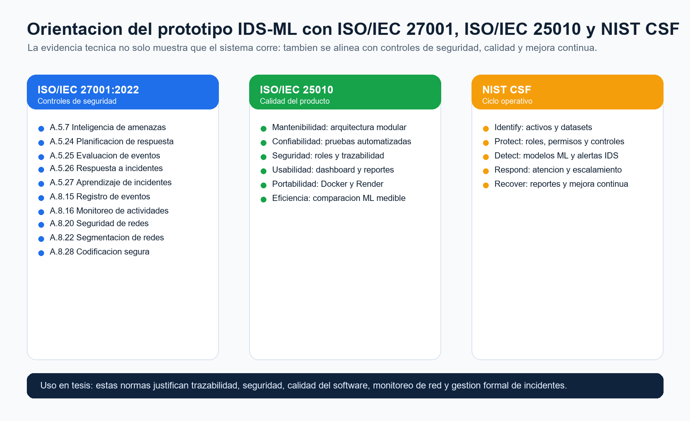

# Informe de evidencias tecnicas IDS-ML

## 1. Proposito

Este documento consolida evidencias visuales para anexar al informe de tesis del sistema IDS-ML orientado a redes institucionales hospitalarias. Las imagenes muestran calidad del codigo, base de datos fisica, proceso operativo de la entidad hospitalaria y alineacion con normas de seguridad y calidad.

## 2. Evidencia SonarQube/SonarCloud

La siguiente imagen resume el resultado oficial consultado desde SonarCloud y GitHub Actions: Quality Gate aprobado, cero bugs, cero vulnerabilidades, cero code smells, cero hotspots y duplicacion 0.0%.

## 3. Evidencia de base de datos

El modelo formal documentado para la tesis contiene 60 tablas academicas. En PostgreSQL tambien se visualizan 8 tablas operativas creadas por la aplicacion para persistir ejecuciones reales del prototipo.

La siguiente lamina lista las 60 tablas formales del esquema PostgreSQL.

## 4. Diagrama de proceso institucional hospitalario

El proceso representa el flujo esperado para una entidad hospitalaria: identificacion de activos, captura de trafico o dataset, validacion, entrenamiento ML, seleccion por F1-score, analisis de trafico nuevo, generacion de alertas, atencion de incidentes, reporte y mejora continua.

## 5. Orientacion ISO/NIST

El prototipo se orienta a controles de seguridad, calidad del producto y ciclo operativo de ciberseguridad. Esto permite justificar que la aplicacion no solo entrena modelos, sino que tambien aporta trazabilidad, monitoreo, gestion de incidentes y mejora continua.

## 6. Uso recomendado en tesis

Estas evidencias pueden colocarse en anexos o en los capitulos de implementacion y validacion:

- SonarCloud/GitHub Actions: capitulo de calidad de software o validacion tecnica.
- Base de datos: capitulo de diseno de base de datos o arquitectura.
- Proceso hospitalario: capitulo de analisis de procesos o diseno institucional.
- ISO/NIST: marco teorico, controles de seguridad, calidad o recomendaciones.

## 7. Observacion

Las imagenes son evidencias documentales generadas desde el estado actual del proyecto. Si se realizan nuevos cambios significativos en codigo, pruebas, base de datos o despliegue, deben regenerarse para mantener coherencia con el repositorio.
