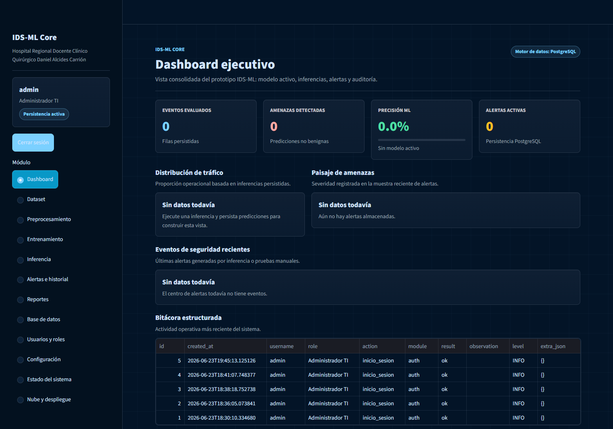
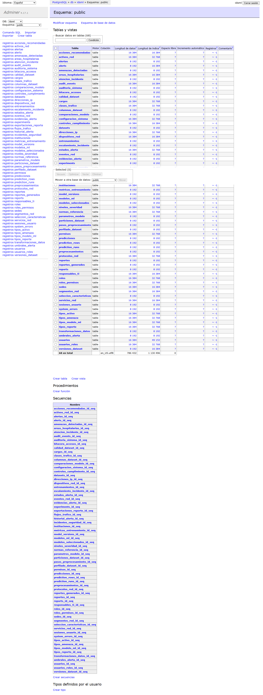
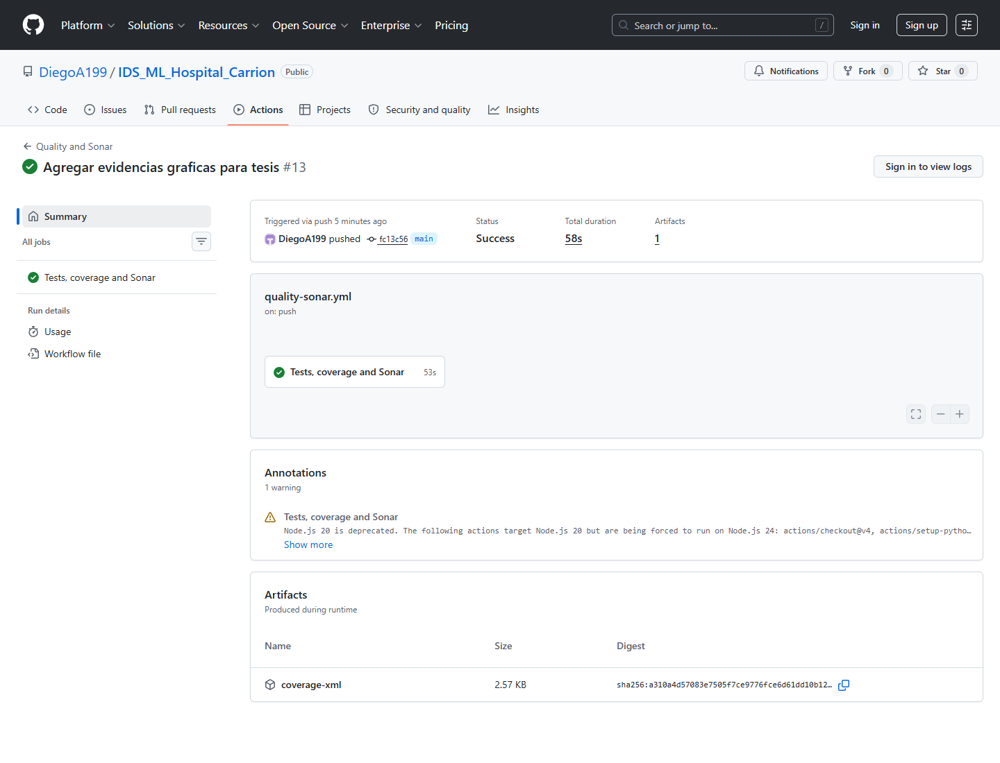

# Informe de evidencias reales IDS-ML

## 1. Proposito

Este documento consolida evidencias reales del proyecto IDS-ML. Las imagenes y archivos fueron obtenidos desde herramientas ejecutadas o servicios vinculados: SonarCloud, GitHub Actions, Adminer/PostgreSQL y la aplicacion Streamlit local con Docker.

## 2. Aplicacion Streamlit ejecutandose

La siguiente captura corresponde a la aplicacion real en `http://127.0.0.1:8501`, con sesion iniciada como administrador.

## 3. Base de datos fisica en el motor PostgreSQL

La siguiente captura corresponde a Adminer conectado al contenedor PostgreSQL del proyecto. Se visualiza el esquema `public` con 68 tablas visibles: 60 tablas formales academicas y 8 tablas operativas de la aplicacion.

Archivos tecnicos relacionados:

- `postgresql_tablas_reales.txt`
- `postgresql_conteo_tablas_reales.txt`

## 4. SonarCloud real

La siguiente captura corresponde al dashboard real de SonarCloud vinculado al repositorio.

Archivos tecnicos relacionados:

- `sonarcloud_quality_gate_api_real.txt`
- `sonarcloud_metrics_api_real.txt`
- `sonarcloud_pr2_verificacion_real.txt`

## 5. GitHub Actions real

La siguiente captura corresponde a la corrida real del workflow `Quality and Sonar` en GitHub Actions.

Archivo tecnico relacionado:

- `github_actions_latest_run_real.txt`

## 6. Procesos hospitalarios y Bizagi

No se encontro un archivo real de Bizagi ni una imagen externa de procesos hospitalarios dentro del repositorio o carpetas locales revisadas. Para cubrir esta evidencia de manera formal, se debe anexar alguno de los siguientes archivos exportados desde Bizagi Modeler:

- archivo fuente `.bpm`;
- exportacion `.bpmn`;
- imagen `.png` o `.jpg` del diagrama de proceso real;
- PDF exportado desde Bizagi.

Mientras no exista ese archivo, cualquier diagrama generado dentro del repositorio debe tratarse como referencia conceptual, no como evidencia real externa.

## 7. Recomendacion para tesis

Usar esta carpeta como evidencia oficial. Las laminas ubicadas directamente en `docs/evidencias/` pueden servir para explicar, pero las capturas de esta carpeta son las que deben presentarse como evidencia real de ejecucion.
