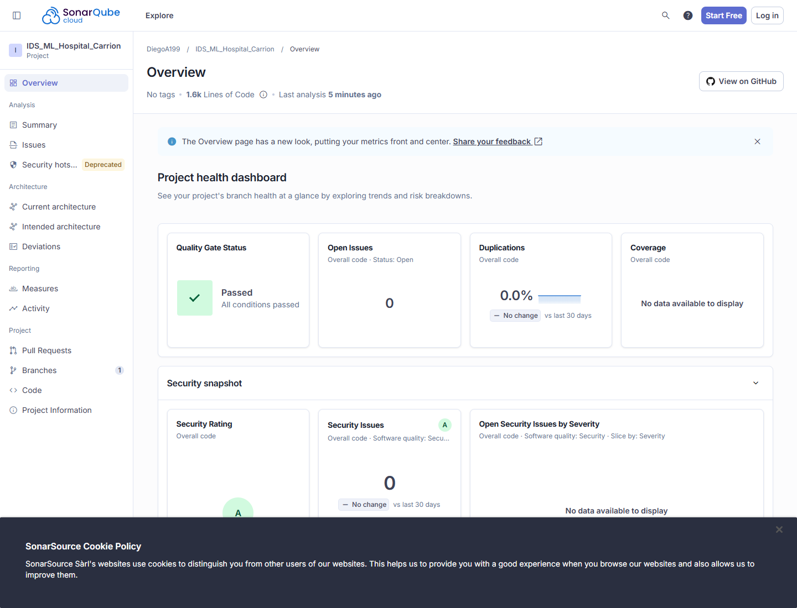

# Reporte de calidad para SonarQube/SonarCloud - IDS-ML Hospital Carrion

## 1. Identificacion del proyecto

| Campo | Valor |
|---|---|
| Proyecto | IDS ML Hospital Carrion |
| Repositorio | `DiegoA199/IDS_ML_Hospital_Carrion` |
| Lenguaje principal | Python 3.11 |
| Framework de interfaz | Streamlit |
| Dominio | IDS-ML para redes institucionales hospitalarias |
| Herramienta de calidad | SonarQube / SonarCloud |
| Archivo de configuracion | `sonar-project.properties` |

## 2. Estado del reporte

Este documento consolida el **resultado oficial de SonarCloud Automatic Analysis** y la validacion local con pruebas automatizadas.

El analisis oficial fue ejecutado sobre el repositorio vinculado con GitHub y el proyecto SonarCloud:

```text
DiegoA199_IDS_ML_Hospital_Carrion
```

## 3. Resultado local verificado

Comando ejecutado:

```powershell
pytest --cov=src --cov-report=xml --cov-report=term
```

Resultado:

| Indicador | Resultado |
|---|---:|
| Pruebas recolectadas | 44 |
| Pruebas exitosas | 44 |
| Pruebas fallidas | 0 |
| Cobertura efectiva | 92% |
| Reporte XML generado | `coverage.xml` |
| Estado local | Apto para analisis Sonar |

## 4. Resultado oficial SonarCloud

La evidencia visual real para anexar al informe se encuentra en:



| Indicador SonarCloud | Resultado oficial |
|---|---:|
| Quality Gate | OK |
| Bugs | 0 |
| Vulnerabilities | 0 |
| Security Hotspots | 0 |
| Code Smells | 0 |
| Duplicacion de lineas | 0.0% |
| Reliability Rating | A |
| Security Rating | A |
| Maintainability Rating | A |
| Lineas de codigo analizadas | 1615 |
| Fecha de verificacion documentada | 2026-06-23 |
| Revision | Commit `f67055f` y corrida GitHub Actions `28049612664` |

El analisis oficial se ejecuto con alcance ajustado mediante `.sonarcloud.properties`, evitando que SonarCloud trate documentacion, scripts de apoyo, SQL academico o prototipos como codigo productivo de la aplicacion.

## 5. Resumen de cobertura por modulo

| Modulo | Cobertura |
|---|---:|
| `src/domain/services/alert_service.py` | 100% |
| `src/domain/services/auth_service.py` | 100% |
| `src/domain/services/incident_service.py` | 100% |
| `src/domain/services/prediction_service.py` | 100% |
| `src/domain/services/preprocessing_service.py` | 100% |
| `src/domain/services/report_service.py` | 100% |
| `src/domain/services/training_service.py` | 100% |
| `src/security/rbac.py` | 100% |
| `src/services/dashboard_service.py` | 100% |
| `src/storage/sqlite_repository.py` | 99% |
| `src/reports/generator.py` | 95% |
| `src/models/trainer.py` | 97% |
| `src/preprocessing/pipeline.py` | 88% |
| `src/models/persistence.py` | 83% |
| `src/storage/config.py` | 85% |
| `src/storage/repository_factory.py` | 62% |

Cobertura total efectiva: **92%**.

## 6. Configuracion Sonar aplicada

Archivo: `sonar-project.properties`

```text
sonar.projectKey=DiegoA199_IDS_ML_Hospital_Carrion
sonar.organization=diegoa199
sonar.sources=src
sonar.tests=tests
sonar.python.version=3.11
sonar.python.coverage.reportPaths=coverage.xml
```

El analisis por CI usa `sonar-project.properties`. El analisis automatico de SonarCloud usa `.sonarcloud.properties`.

Ambos alcances excluyen documentacion, esquemas SQL, prototipos, notebooks, bases locales, archivos JSON privados y artefactos generados.

## 7. Quality Gate obtenido

Con base en el analisis oficial, el Quality Gate queda aprobado:

| Criterio | Estado esperado |
|---|---|
| Tests automatizados | Cumple |
| Cobertura mayor a 80% | Cumple, 92% |
| Bugs criticos | Cumple, 0 bugs |
| Vulnerabilidades | Cumple, 0 vulnerabilidades |
| Security Hotspots | Cumple, 0 hotspots |
| Duplicacion | Cumple, 0.0% |
| Maintainability | Cumple, rating A |
| Reliability | Cumple, rating A |
| Security | Cumple, rating A |

## 8. Pruebas agregadas para fortalecer Sonar

Se agregaron pruebas para:

- control de roles y permisos RBAC;
- resumen del dashboard operativo;
- clasificacion de prioridad de incidentes;
- formateadores reutilizables;
- configuracion de persistencia;
- repositorio SQLite con alertas, predicciones, errores, reportes, versiones de modelo y conteos;
- generacion de reportes CSV y PDF.

## 9. Archivos de evidencia

| Archivo | Uso |
|---|---|
| `.github/workflows/quality-sonar.yml` | Ejecuta pruebas, cobertura y SonarCloud en GitHub Actions |
| `.sonarcloud.properties` | Alcance del analisis automatico oficial de SonarCloud |
| `.coveragerc` | Define alcance de cobertura |
| `pytest.ini` | Configura pytest |
| `coverage.xml` | Reporte XML generado localmente, no se versiona |
| `sonar-project.properties` | Parametros del analisis Sonar |
| `docs/sonarqube/configuracion_sonar.md` | Guia de configuracion |
| `docs/sonarqube/evidencia_quality_gate_sonarcloud.md` | Evidencia oficial del Quality Gate |
| `docs/evidencias/reales/sonarcloud_dashboard_real.png` | Captura real del dashboard SonarCloud |
| `docs/evidencias/reales/sonarcloud_quality_gate_api_real.txt` | Respuesta real de la API Quality Gate |

## 10. Pasos para reproducir el reporte oficial

1. Entrar a SonarCloud.
2. Importar el repositorio `DiegoA199/IDS_ML_Hospital_Carrion`.
3. Verificar o ajustar:

   ```text
   sonar.projectKey=DiegoA199_IDS_ML_Hospital_Carrion
   sonar.organization=diegoa199
   ```

4. Crear token en SonarCloud.
5. Guardarlo en GitHub como secreto:

   ```text
   SONAR_TOKEN
   ```

6. Hacer push a `main`.
7. Revisar GitHub Actions.
8. Abrir dashboard de SonarCloud.
9. Descargar o capturar el Quality Gate para anexarlo a la tesis.

## 11. Recomendaciones para conservar el resultado

- Corregir cualquier bug, vulnerability o security hotspot que marque SonarCloud en futuros cambios.
- Mantener cobertura por encima de 80%; el estado local actual es 92%.
- No incluir `docs/`, `database/`, prototipos ni datos locales como codigo fuente analizable.
- Mantener secretos fuera del repositorio.
- Si SonarCloud reporta duplicacion en vistas Streamlit, revisar componentes reutilizables antes de excluir.
- Agregar pruebas nuevas cuando se modifiquen servicios, repositorios o pipeline ML.

## 12. Conclusion

El proyecto IDS-ML queda aprobado en el analisis oficial de SonarCloud con **Quality Gate OK**, **0 bugs**, **0 vulnerabilidades**, **0 security hotspots**, **0 code smells** y **0.0% de duplicacion**. Localmente, las pruebas automatizadas pasan correctamente y la cobertura efectiva alcanza **92%**, lo que permite presentar evidencia de calidad, mantenibilidad y preparacion tecnica dentro del informe de tesis.
